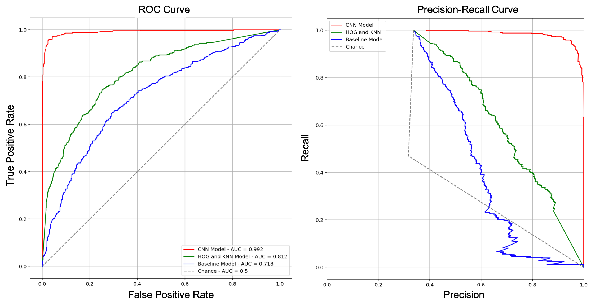

# Solar Panel Detection
Detecting solar panels from aerial imagery data using a variety of supervised machine learning methods.

# Overview
The goal of the project is to detect solar panels in satellite imagery data. The data contains 1500 labeled images. This is a binary classification problem where the label contains 0 (solar panel present) or 1 (solar panel absent). We tried both conventional machine learning and modern deep learning algorithms to perform the detection. The following methods were used:

1. Logistic regression trained on HOG features. This is our baseline model.
2. K-nearest neighbors trained on HOG features.
3. Convolutional neural network.

The following ROC and PR curve demonstrates the performance of each method.

The detailed report of our findings is present in `report/report.pdf`. If you wish to run the code, clone the repository and execute the code present in `code/solar-panel-detection.py`.
